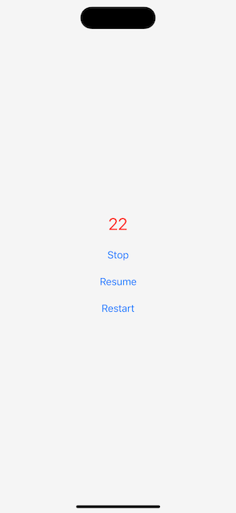

# BackgroundTimer

Background timer that works without background modes.



## Usage

```swift
struct MyView: View {
    @StateObject private var backgroundTimer = BackgroundTimer()
    
    var body: some View {
        Text("\(backgroundTimer.timeRemaining)")
            .font(.title)
            .foregroundStyle(.red)
            .onAppear {
                backgroundTimer.start(with: 30)
            }
    }
}
```

## Requirements

- iOS 15.0 +
- Xcode 15.0 +
- [SwiftUI](https://developer.apple.com/xcode/swiftui/)

## License

- BackgroundTimer is distributed under the MIT License.
